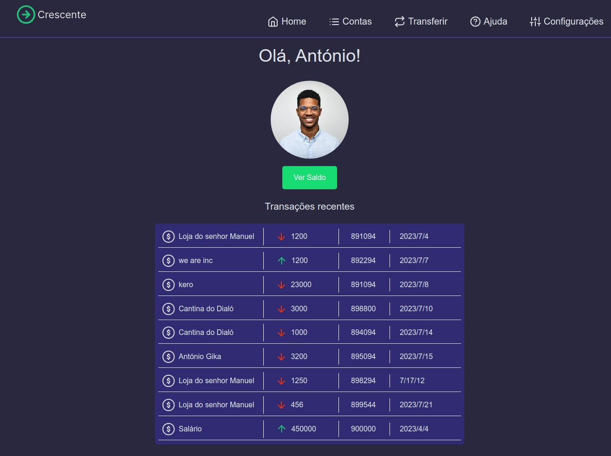
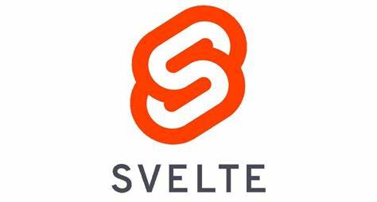

# Crescente

projecto ficticio para uma plataforma de gestão de contas, onde o usuário pode ver o histórico de transações, pode fazer transferências, etc...

## Construído com:

## Getting Started

Como instalar localmente no seu pc:

### Setup

- Abrir o terminal

### Install

- Vá até o directorio desejado e
- digite git clone git@github.com:helciodev/nellcorp-frontend-chalenge.git comando
- npm install or yarn install

## Autor

😎 **Helcio André**

- GitHub: [@helciodev](https://github.com/helciodev)
- Twitter: [@helcio_bruno](https://twitter.com/helcio_bruno)
